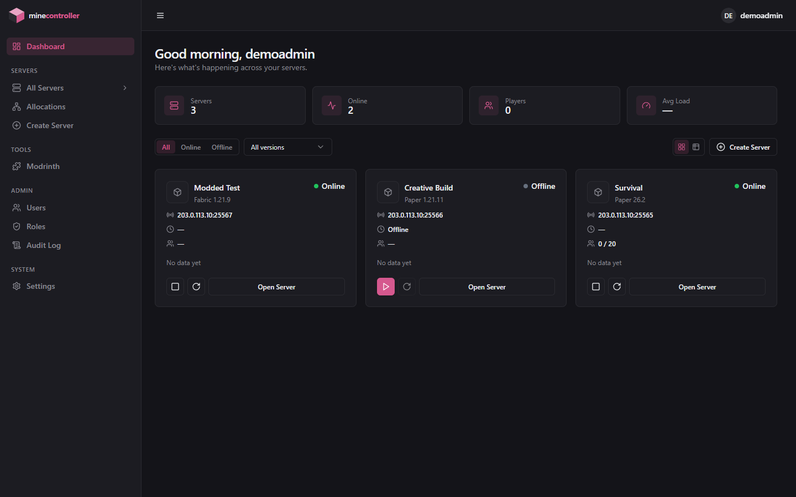
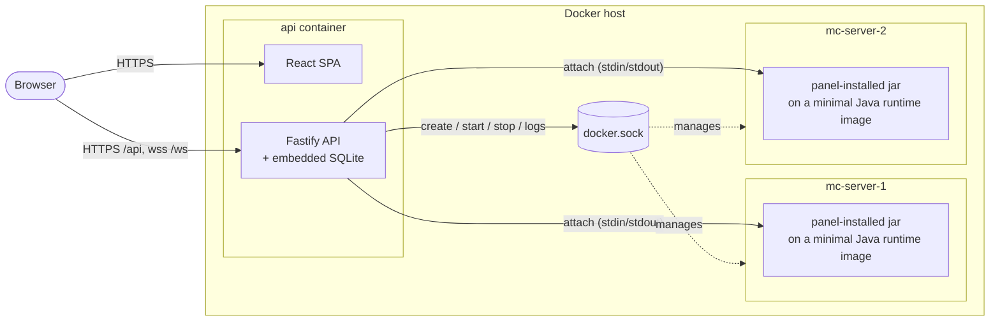
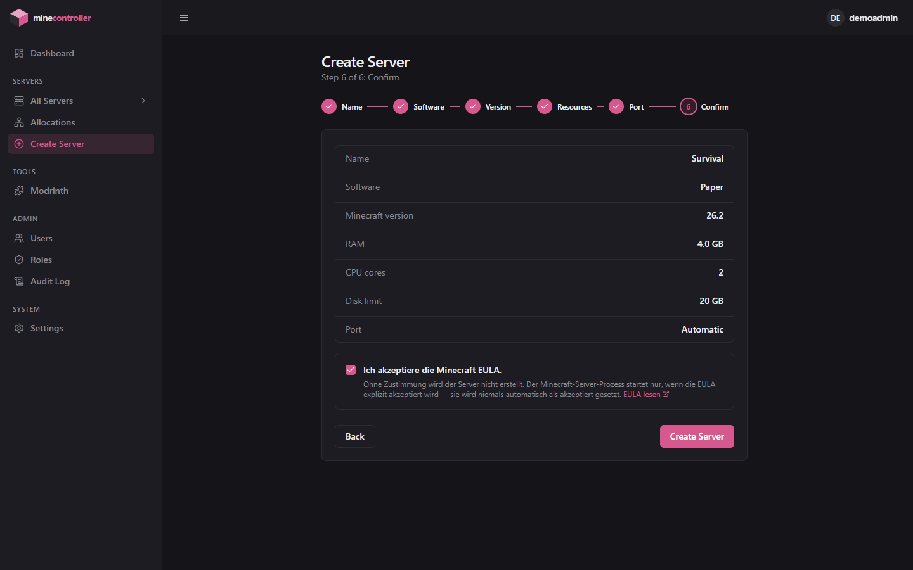
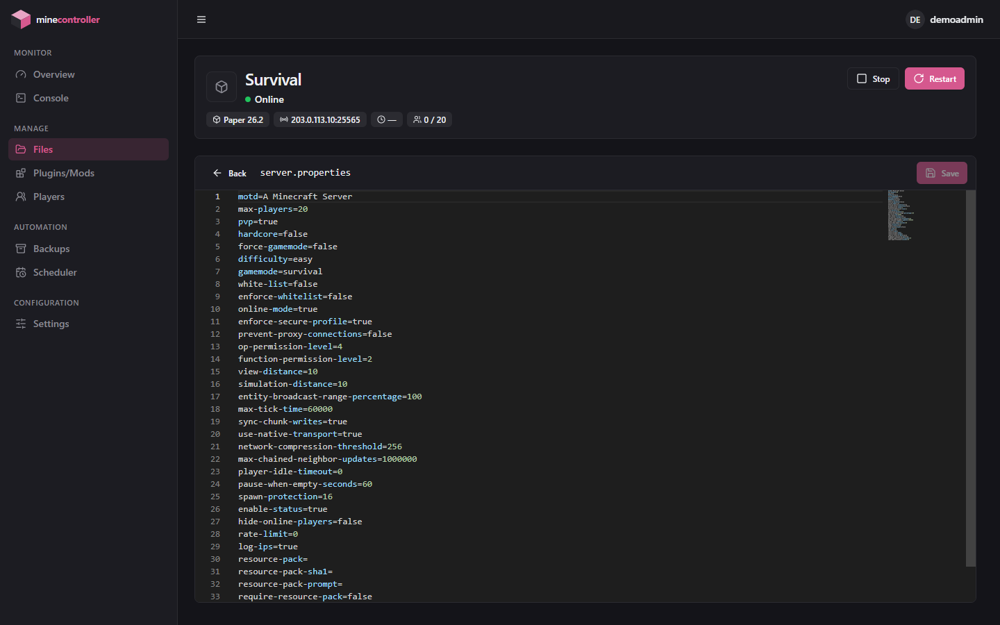
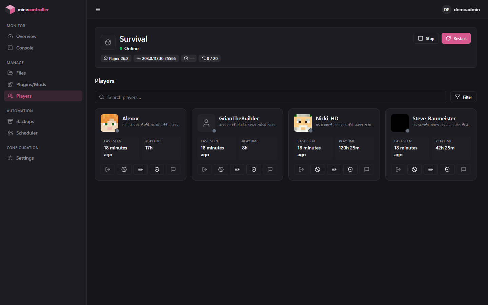

<p align="center">
  
</p>

<h1 align="center">minecontroller</h1>

<p align="center">
  <a href="https://github.com/nicki41/minecontroller/actions/workflows/ci.yml"></a>
  <a href="https://github.com/nicki41/minecontroller/actions/workflows/docker-publish.yml"></a>
  <a href="LICENSE"></a>
</p>

A self-hosted management panel for multiple Minecraft servers. Each server runs in its own Docker container — installed and launched by the panel itself, on minimal Java-only runtime images it publishes ([`runtime-images/`](runtime-images/)), not a third-party all-in-one image — managed through a Fastify/TypeScript API with an embedded SQLite database and a React UI. One container, no separate database service, no build step — every image is pulled pre-built from GitHub Container Registry, so `docker compose up -d` really is all it takes.



**Features:**

- **Creation wizard** — Vanilla / Paper / Fabric fully supported; Forge / NeoForge selectable but their install pipeline isn't finished yet (see [docs/architecture.md](docs/architecture.md#server-creation-flow))
- **Dashboard** — every server at a glance: status, uptime, players/slots, ip:port, version, and a live load sparkline
- **Live attached console** — real stdin/stdout, not a third-party RCON wrapper
- **File manager** with a Monaco (VS Code) editor
- **Modrinth integration** — search and install plugins/mods straight from the panel
- **Port allocations** — open extra ports per server (voice chat, a web map, Geyser, ...) from one place, with automatic no-duplicates enforcement
- **Player management** — whitelist / op / kick / ban, playtime and session history
- **Multi-user RBAC** — role-based *and* per-server access control (view-only vs. full)
- **Audit log** of every meaningful action
- **Manual backups**, plus a scheduler for recurring workflows (backup, restart, console commands, ...)
- **Per-server RAM/CPU limits**
- **Notifications** — web push (per user, zero-config VAPID) and external channels (Discord/Telegram/Slack/webhook, per server)
- **Installable PWA** — add it to your home screen on iOS/Android or install it as a desktop app; fully responsive down to phone width

A complete tour with screenshots of every feature is in **[docs/FEATURES.md](docs/FEATURES.md)**.

## Table of contents

- [Architecture](#architecture)
- [Prerequisites](#prerequisites)
- [Setup](#setup)
- [Starting the panel](#starting-the-panel)
- [First-time setup](#first-time-setup)
  - [1. Create the admin account](#1-create-the-admin-account)
  - [2. The dashboard](#2-the-dashboard)
  - [3. Create your first server](#3-create-your-first-server)
  - [4. Connect from Minecraft](#4-connect-from-minecraft)
  - [5. Optional next steps](#5-optional-next-steps)
- [Features & screenshots](#features--screenshots)
- [Documentation](#documentation)
- [Contributing](#contributing)
- [License](#license)

## Architecture

Everything the panel itself needs runs in a single container; every managed Minecraft server is a separate sibling container, created via the host's Docker socket.



Full breakdown — component diagram, server-creation flow, RBAC model, and the reasoning behind these choices — is in **[docs/architecture.md](docs/architecture.md)**.

## Prerequisites

- Docker Engine 24+ with Docker Compose v2 (`docker compose`, not the legacy `docker-compose`)
- A Linux host (amd64 or arm64 — Raspberry Pi included), or Docker Desktop (Windows/macOS) with the WSL2 backend enabled
- At least as much RAM as the sum of all planned Minecraft servers, plus roughly 256 MB for the panel itself (SQLite runs embedded in the same process — no separate DB service needed)
- Free ports: the panel port (default `3000`) and one port per Minecraft server out of the configured range (default `25565`–`25664`)
- No Node.js install, no `git clone`, no build step — every image is pulled pre-built (see [docs/development.md](docs/development.md) if you're contributing code instead of just running the panel)

## Setup

Two files, downloaded directly — no repository checkout needed:

```bash
mkdir minecontroller && cd minecontroller
curl -fsSLO https://raw.githubusercontent.com/nicki41/minecontroller/main/docker-compose.yml
curl -fsSLo .env https://raw.githubusercontent.com/nicki41/minecontroller/main/.env.example
```

Then edit `.env` — **`SESSION_SECRET`** is the only thing you must change (generate one with `openssl rand -hex 32`). Everything else has a sensible default; the database needs no configuration at all, and the host path for server data is auto-detected on boot (no absolute path to figure out). See **[docs/configuration.md](docs/configuration.md)** for the full variable reference.

## Starting the panel

```bash
docker compose up -d
```

This pulls and starts the single `api` container (which automatically creates or migrates the SQLite database under `data/db.sqlite` on boot, via `prisma migrate deploy`) and serves the panel at `http://localhost:<PANEL_PORT>` (default `3000`) — frontend, API, and database all run in the same container/process. The Java runtime images used for newly created Minecraft servers are pulled automatically too, the first time each is needed — nothing to build by hand.

Follow logs:

```bash
docker compose logs -f api
```

Stop the panel (data is preserved):

```bash
docker compose down
```

Updating later is just:

```bash
docker compose pull && docker compose up -d
```

## First-time setup

A walkthrough from empty panel to a Minecraft server you can actually join, end to end.

### 1. Create the admin account

Open `http://<your-host>:3000` (or wherever `WEB_ORIGIN` points). The panel detects that its database has zero users and shows a **setup wizard** instead of a login form: pick a username, email, and password. This creates the first account with the built-in `Owner` role — every permission, always, no matter what roles change later.

This setup route only works while the user table is empty; it locks itself permanently the moment that first account exists (enforced server-side, not just hidden in the UI). If you ever lose access to it, see [docs/operations.md#first-admin-account](docs/operations.md#first-admin-account).

### 2. The dashboard

After signing in you land on the **dashboard** — a greeting, four summary tiles (server count, online count, players, avg. CPU), and a card per server you can see. On a brand new install that list is empty, with a single **Create Server** button.

The sidebar on the left is where everything else lives:

| Section | What's there |
|---|---|
| **Dashboard** | This overview page |
| **All Servers** | Expand it in place for a quick jump list, or click through to the full page |
| **Allocations** | Open extra ports on any server — see [docs/operations.md#port-allocations](docs/operations.md#port-allocations) |
| **Create Server** | The creation wizard (below) |
| **Modrinth** | Search and install plugins/mods |
| **Admin → Users / Roles / Audit Log** | Only visible once you have more than one user, or want to review activity |
| **Settings** | Your own account (password, 2FA) |

### 3. Create your first server

Click **Create Server** and work through the wizard:

1. **Name** — a name and optional description.
2. **Software** — Vanilla, Paper, or Fabric (Forge/NeoForge are shown but not installable yet).
3. **Version** — fetched live from that software's own metadata API, newest first.
4. **Resources** — RAM and CPU limits; an optional disk limit.
5. **Port** — leave it automatic (assigned from the configured range) or pick one explicitly.
6. **Confirm** — review everything, then explicitly accept Mojang's EULA; the panel refuses to boot a server otherwise, matching the real-world legal requirement, and never accepts it on your behalf.

<p align="center"></p>

Submitting takes you straight to the new server's **Console** tab, where you can watch it move through `CREATING` → `INSTALLING` (downloading and verifying the actual server jar — nothing pre-baked into an image) → `STARTING` → `RUNNING`. First boot is the slowest step (world generation); everything after is normal Minecraft startup time.

### 4. Connect from Minecraft

Once the server shows `Running`, its card (on the dashboard or the server's own **Overview** page) shows the address as `<your-host-ip>:<port>` — that's exactly what goes into the Minecraft client's *Add Server* dialog. The port is whatever was auto-assigned from `MC_PORT_RANGE_MIN`–`MC_PORT_RANGE_MAX` (see [docs/configuration.md](docs/configuration.md)) unless you set one explicitly.

Need more than the one game port — a Dynmap/BlueMap web view, a voice-chat plugin, Geyser? Open **Allocations** in the sidebar, pick the server, and add the extra port there. No two servers (and no two ports, extra or primary) can ever collide — the panel checks that instance-wide. New allocations apply the next time that specific server restarts, same as a RAM/CPU change.

### 5. Optional next steps

- **Invite your team**: **Admin → Users** → create a user, assign a role (`Admin`/`Manager`/`Moderator`/`Viewer`, or a custom one under **Admin → Roles**), and optionally scope them to specific servers as `Full` or `View only` access.
- **Turn on 2FA** for your own account under **Settings**.
- **Set up a backup schedule** or other recurring workflow from a server's **Scheduler** tab, instead of relying only on manual backups.
- **Install plugins/mods** via the **Modrinth** page — search, pick a version compatible with your server's software/Minecraft version, and install in one click.
- **Install the panel as an app** on your phone or desktop (it's a PWA) and turn on push notifications for server status, crashes, and more — see [docs/operations.md#installing-the-panel-as-an-app-pwa](docs/operations.md#installing-the-panel-as-an-app-pwa).

For everything after this first run — adding more admins, backup strategy, updating the panel, and troubleshooting — see **[docs/operations.md](docs/operations.md)**.

## Features & screenshots

A screenshot of every feature — the console, file manager, players, Modrinth browser, scheduler, notifications, RBAC/admin pages, 2FA setup, and the mobile view — lives in **[docs/FEATURES.md](docs/FEATURES.md)**.

<p align="center">
  
  
</p>

## Documentation

| Doc | Covers |
|---|---|
| [docs/FEATURES.md](docs/FEATURES.md) | Full feature tour with screenshots |
| [docs/architecture.md](docs/architecture.md) | Component diagram, server-creation sequence, RBAC model, directory layout, design decisions |
| [docs/configuration.md](docs/configuration.md) | Full `.env` reference, the `HOST_DATA_PATH` sibling-container problem |
| [docs/operations.md](docs/operations.md) | First admin account, backups, updates, troubleshooting |
| [docs/security.md](docs/security.md) | Threat model, hardening measures (OWASP-mapped), accepted residual risks |
| [docs/development.md](docs/development.md) | Local dev setup without a full Docker rebuild, npm scripts, running tests |

## Contributing

Bug reports, feature requests, and pull requests are welcome — see [CONTRIBUTING.md](CONTRIBUTING.md). Found a security issue? See [SECURITY.md](SECURITY.md) instead of opening a public issue.

## License

[GNU GPL v3.0](LICENSE) — free to self-host, modify, and redistribute; modified versions must stay open under the same license.
