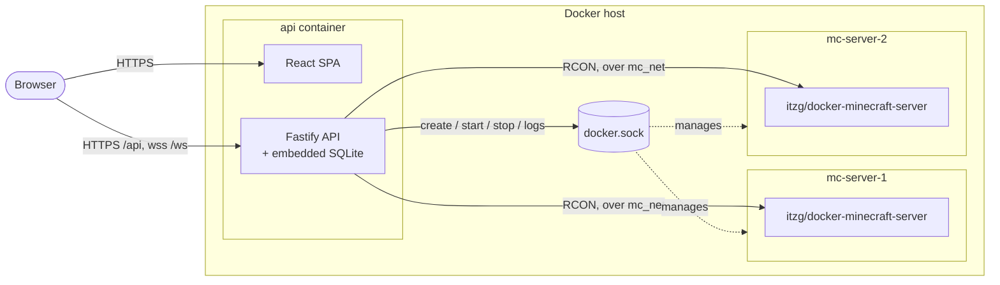

<p align="center">
  
</p>

<h1 align="center">minecontroller</h1>

<p align="center">
  <a href="https://github.com/nicki41/minecontroller/actions/workflows/ci.yml"></a>
  <a href="https://github.com/nicki41/minecontroller/actions/workflows/docker-publish.yml"></a>
  <a href="LICENSE"></a>
</p>

A self-hosted management panel for multiple Minecraft servers. Each server runs in its own Docker container (base image [`itzg/docker-minecraft-server`](https://github.com/itzg/docker-minecraft-server)), managed through a Fastify/TypeScript API with an embedded SQLite database and a React UI. One container, no separate database service, no build step — the image is pulled pre-built from GitHub Container Registry, so `docker compose up -d` really is all it takes.

**Features:** server creation wizard (Vanilla / Paper / Fabric / Forge / NeoForge) · live console · file manager with a Monaco editor · Modrinth plugin/mod search and install · player management (whitelist / op / kick / ban) · multi-user with role-based and per-server access control · audit log · manual backups · per-server RAM/CPU limits.

## Table of contents

- [Architecture](#architecture)
- [Prerequisites](#prerequisites)
- [Setup](#setup)
- [Starting the panel](#starting-the-panel)
- [First-time setup](#first-time-setup)
- [Documentation](#documentation)
- [Contributing](#contributing)
- [License](#license)

## Architecture

Everything the panel itself needs runs in a single container; every managed Minecraft server is a separate sibling container, created via the host's Docker socket.



Full breakdown — component diagram, server-creation flow, RBAC model, and the reasoning behind these choices — is in **[docs/architecture.md](docs/architecture.md)**.

## Prerequisites

- Docker Engine 24+ with Docker Compose v2 (`docker compose`, not the legacy `docker-compose`)
- A Linux host (amd64 or arm64 — Raspberry Pi included), or Docker Desktop (Windows/macOS) with the WSL2 backend enabled
- At least as much RAM as the sum of all planned Minecraft servers, plus roughly 256 MB for the panel itself (SQLite runs embedded in the same process — no separate DB service needed)
- Free ports: the panel port (default `3000`) and one port per Minecraft server out of the configured range (default `25565`–`25664`)
- No Node.js install, no `git clone`, no build step — every image is pulled pre-built (see [docs/development.md](docs/development.md) if you're contributing code instead of just running the panel)

## Setup

Two files, downloaded directly — no repository checkout needed:

```bash
mkdir minecontroller && cd minecontroller
curl -fsSLO https://raw.githubusercontent.com/nicki41/minecontroller/main/docker-compose.yml
curl -fsSLo .env https://raw.githubusercontent.com/nicki41/minecontroller/main/.env.example
```

Then edit `.env` — **`SESSION_SECRET`** is the only thing you must change (generate one with `openssl rand -hex 32`). Everything else has a sensible default; the database needs no configuration at all, and the host path for server data is auto-detected on boot (no absolute path to figure out). See **[docs/configuration.md](docs/configuration.md)** for the full variable reference.

## Starting the panel

```bash
docker compose up -d
```

This pulls and starts the single `api` container (which automatically creates or migrates the SQLite database under `data/db.sqlite` on boot, via `prisma migrate deploy`) and serves the panel at `http://localhost:<PANEL_PORT>` (default `3000`) — frontend, API, and database all run in the same container/process. The Java runtime images used for newly created Minecraft servers are pulled automatically too, the first time each is needed — nothing to build by hand.

Follow logs:

```bash
docker compose logs -f api
```

Stop the panel (data is preserved):

```bash
docker compose down
```

Updating later is just:

```bash
docker compose pull && docker compose up -d
```

## First-time setup

On the very first visit to `http://localhost:3000`, the panel detects that no user exists yet and walks you through creating the first admin account. Further users, backups, updates, and troubleshooting are covered in **[docs/operations.md](docs/operations.md)**.

## Documentation

| Doc | Covers |
|---|---|
| [docs/architecture.md](docs/architecture.md) | Component diagram, server-creation sequence, RBAC model, directory layout, design decisions |
| [docs/configuration.md](docs/configuration.md) | Full `.env` reference, the `HOST_DATA_PATH` sibling-container problem |
| [docs/operations.md](docs/operations.md) | First admin account, backups, updates, troubleshooting |
| [docs/security.md](docs/security.md) | Threat model, hardening measures (OWASP-mapped), accepted residual risks |
| [docs/development.md](docs/development.md) | Local dev setup without a full Docker rebuild, npm scripts, running tests |

## Contributing

Bug reports, feature requests, and pull requests are welcome — see [CONTRIBUTING.md](CONTRIBUTING.md). Found a security issue? See [SECURITY.md](SECURITY.md) instead of opening a public issue.

## License

[GNU GPL v3.0](LICENSE) — free to self-host, modify, and redistribute; modified versions must stay open under the same license.
