# Features

A tour of everything minecontroller does, with screenshots. For setup, see the [main README](../README.md); for the technical reasoning behind any of this, see [architecture.md](architecture.md).

All screenshots below are from a local demo instance seeded with placeholder data (`demo@example.com`, example usernames, an RFC 5737 documentation IP) — not a real deployment.

## Table of contents

- [Dashboard](#dashboard)
- [Server creation wizard](#server-creation-wizard)
- [Live console](#live-console)
- [File manager](#file-manager)
- [Players](#players)
- [Plugins & mods (Modrinth)](#plugins--mods-modrinth)
- [Backups](#backups)
- [Scheduler](#scheduler)
- [Port allocations](#port-allocations)
- [Notifications](#notifications)
- [Users, roles & audit log](#users-roles--audit-log)
- [Account security](#account-security)
- [PWA & mobile](#pwa--mobile)

## Dashboard

Every server at a glance: status, uptime, online player count, ip:port, software/version, and a live load sparkline. Filter by online/offline or by Minecraft version, switch between a card grid and a dense table, and jump straight into a server from its card.

## Server creation wizard

A six-step wizard from a bare name to a running server. **Vanilla, Paper, and Fabric are fully supported** — the panel resolves, downloads, and hash-verifies the actual server jar itself, live against that software's own metadata API (Mojang Piston-Meta, PaperMC, Fabric Meta), rather than delegating to a third-party image. Forge/NeoForge are selectable but their install pipeline isn't finished yet (see [architecture.md#server-creation-flow](architecture.md#server-creation-flow)).

| Name & description | Software | Version |
|---|---|---|
| 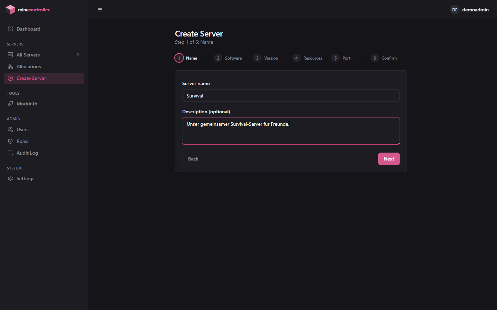 | 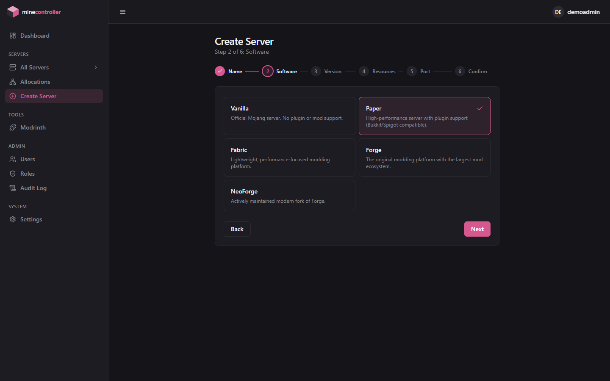 | 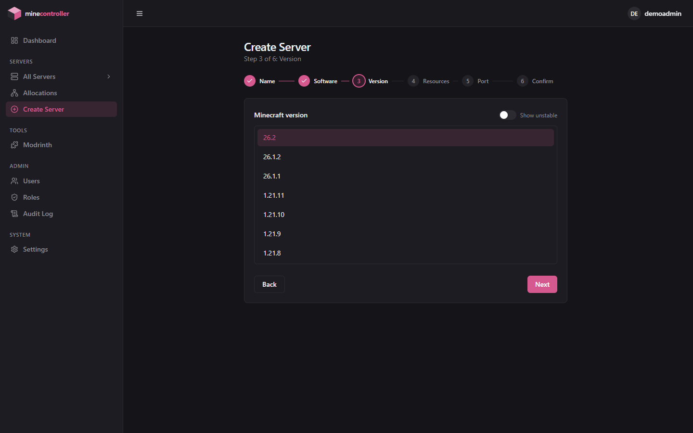 |

| Resources | Confirm & EULA |
|---|---|
| 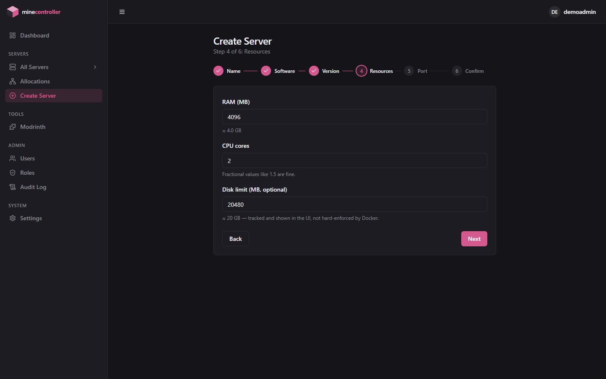 |  |

RAM/CPU limits and an optional disk limit are set here (and editable later from Settings). The final step requires explicitly accepting Mojang's EULA — the panel refuses to boot a server otherwise, matching the real legal requirement, and never accepts it on your behalf.

## Live console

A real attached stdin/stdout console for panel-managed servers — not a third-party RCON wrapper. Commands typed here go straight to the Minecraft process; the same channel backs moderation actions and the live player list. See [architecture.md#console-attached-stdin-not-rcon](architecture.md#console-attached-stdin-not-rcon) for why this matters.

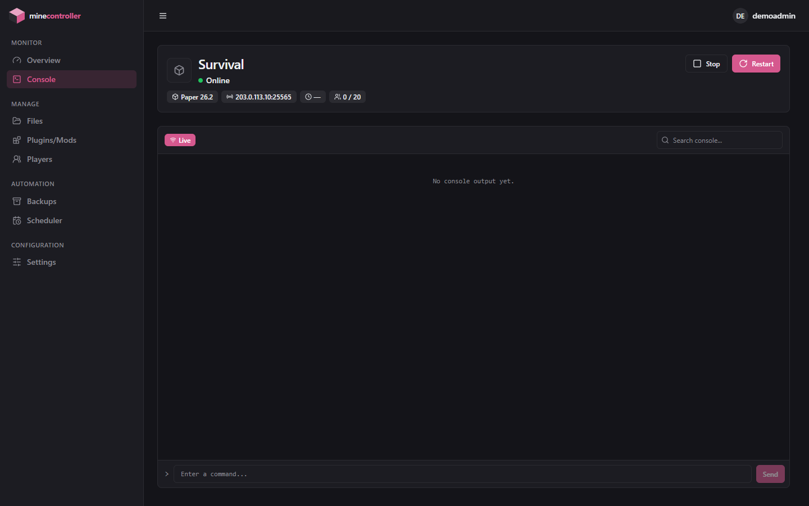

## File manager

A full file browser with a Monaco (VS Code) editor — the same editor, the same syntax highlighting, right in the browser. Create, rename, move, copy, zip/unzip, and edit anything in the server's data directory, including `server.properties` with inline validation.

## Players

Playtime, session history, last-seen, and last-known IP per player, tracked from live server log output — not just whatever `ops.json`/`whitelist.json`/`banned-players.json` currently say. Whitelist, op, kick, and ban actions are one click away.

## Plugins & mods (Modrinth)

Search and install plugins/mods straight from the panel, matched automatically to the server's actual loader (Paper/Fabric/...) and Minecraft version — no manually hunting for a compatible build.

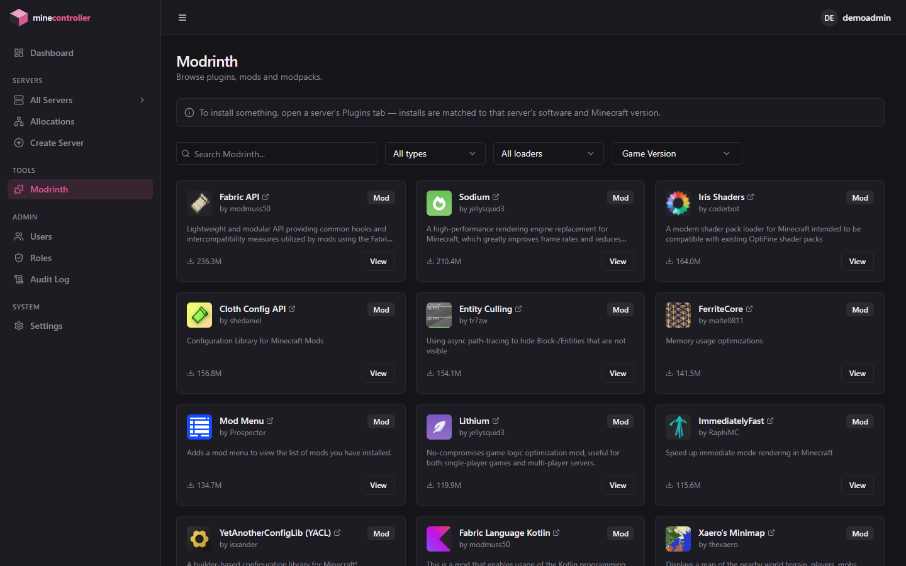

## Backups

Manual, on-demand backups — a `tar` archive of the server's entire data directory, stored outside that directory so a restore can never overwrite the archive it's restoring from. Create, download, restore, or delete from one list.

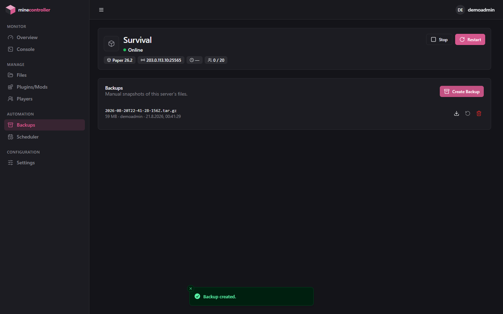

## Scheduler

Cron-driven workflows of ordered steps — console commands, start/stop/restart, or a backup — each with an optional delay before the next step runs. Point it at a nightly backup, a scheduled restart, or a `say` announcement before one.

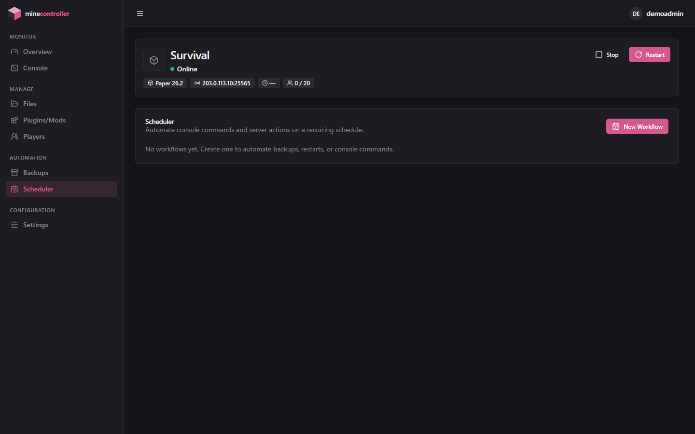

## Port allocations

Open extra ports per server — a Dynmap/BlueMap web view, a voice-chat plugin, Geyser for Bedrock cross-play — from one instance-wide page, with automatic no-duplicate enforcement across every server's primary port and every allocation. See [operations.md#port-allocations](operations.md#port-allocations).

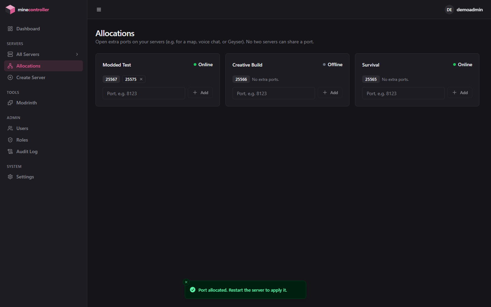

## Notifications

Two independent delivery mechanisms sharing one fixed set of categories (server status, player activity, crashes, backups, high memory usage, new version available):

- **Web push**, per user per server — standard VAPID Web Push, works out of the box with zero configuration (the panel generates and persists its own keypair on first boot), including on iOS 16.4+ as an installed PWA.
- **External service channels**, per server — Discord, Telegram, Slack, or a generic webhook, for cases like a community Discord where everyone should see the message regardless of who's logged into the panel. Secrets are encrypted at rest and only visible to users with full (not view-only) access to that server.

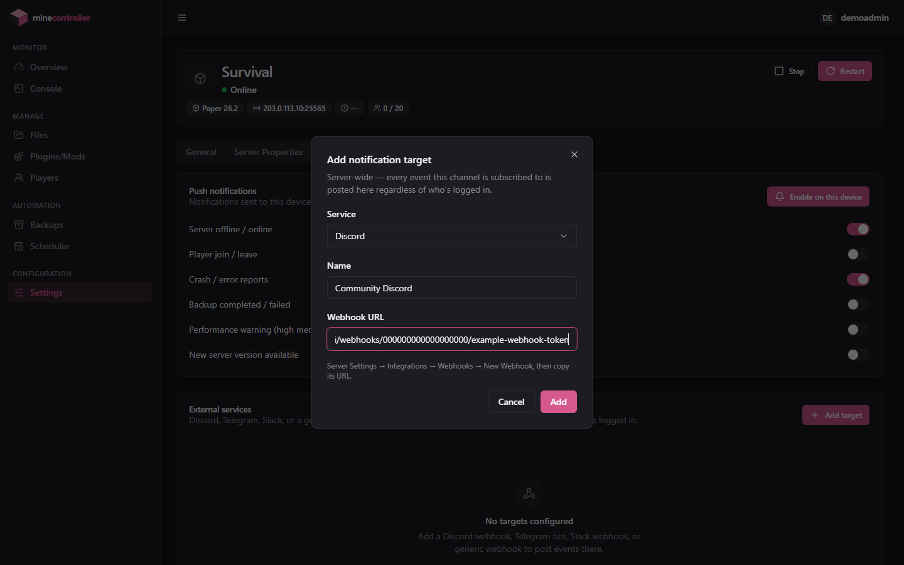

## Users, roles & audit log

Two-layer RBAC — a fixed set of global permissions per role (`Owner`/`Admin`/`Manager`/`Moderator`/`Viewer`, or a custom role you define), plus a per-server access level (`Full` or `View only`) that narrows the server-scoped subset of those permissions down for one specific server. Every meaningful action across the panel lands in the audit log.

| Users | Roles | Audit log |
|---|---|---|
| 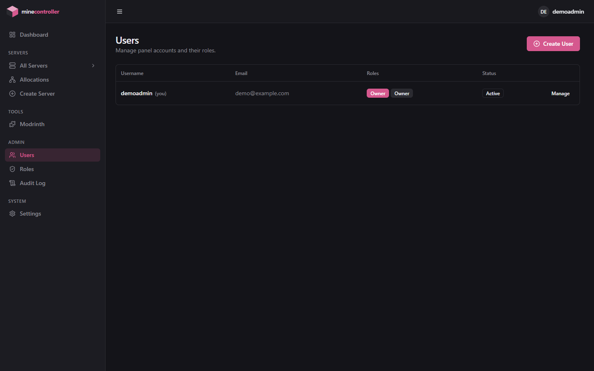 | 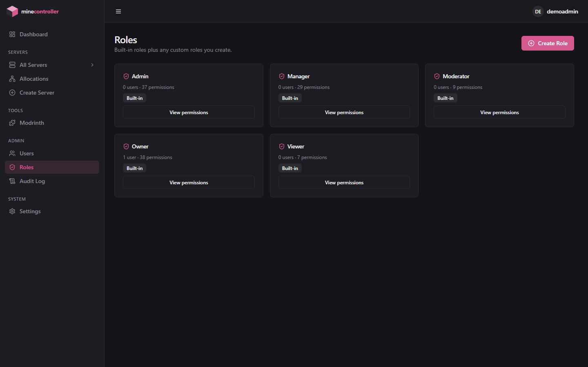 | 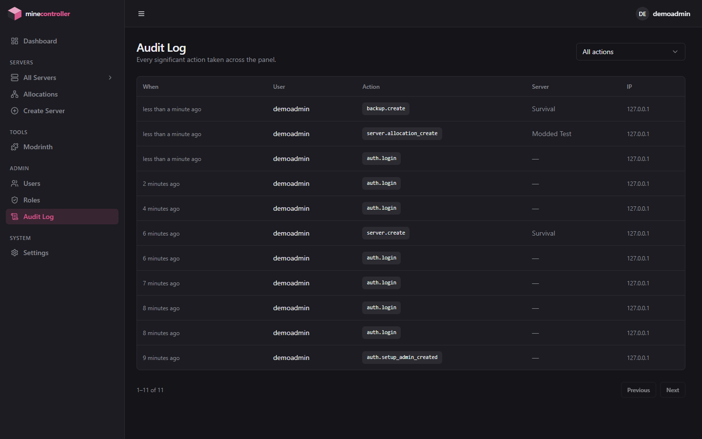 |

## Account security

Argon2id password hashing, and optional TOTP two-factor authentication with a standard authenticator app (Google Authenticator, Aegis, 1Password, ...) — set up per account under Settings.

| Account settings | Setting up 2FA |
|---|---|
| 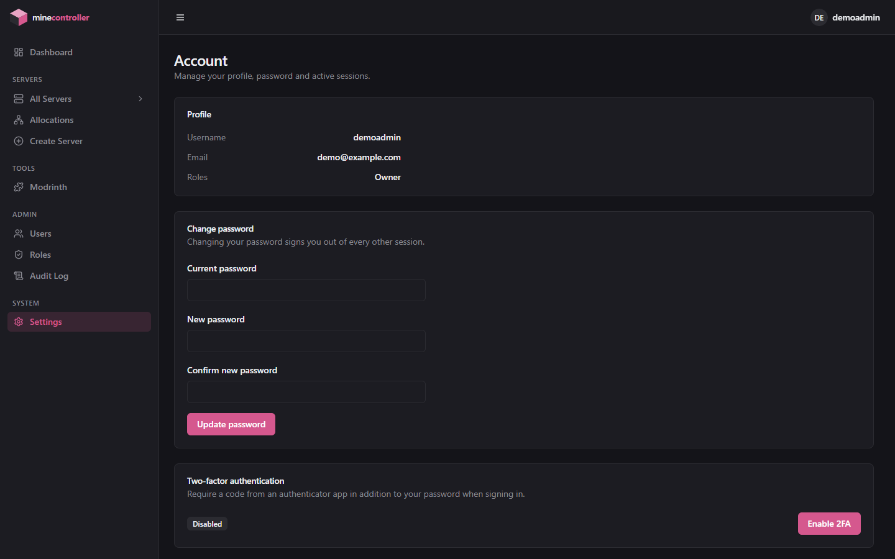 | 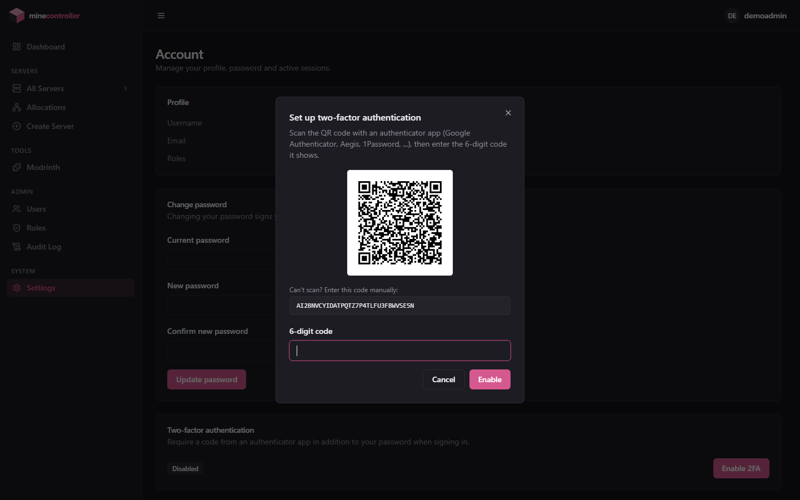 |

## PWA & mobile

The panel is an installable Progressive Web App — add it to your home screen on iOS/Android or install it as a standalone window on desktop, complete with app icon, splash screen, and offline-tolerant shell. The whole UI is responsive down to phone width, with an off-canvas sidebar instead of a squeezed desktop layout.

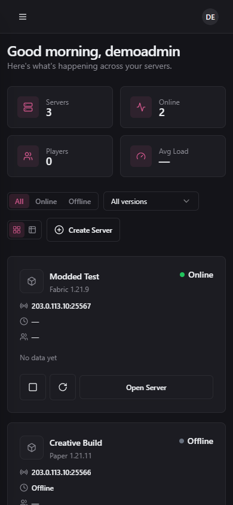
