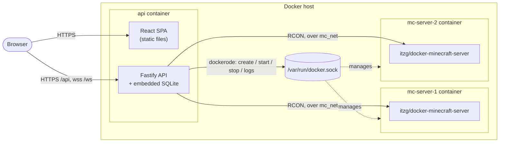
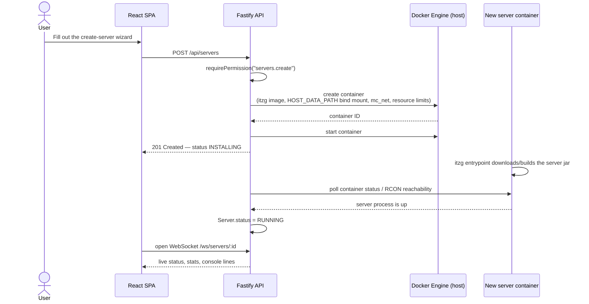
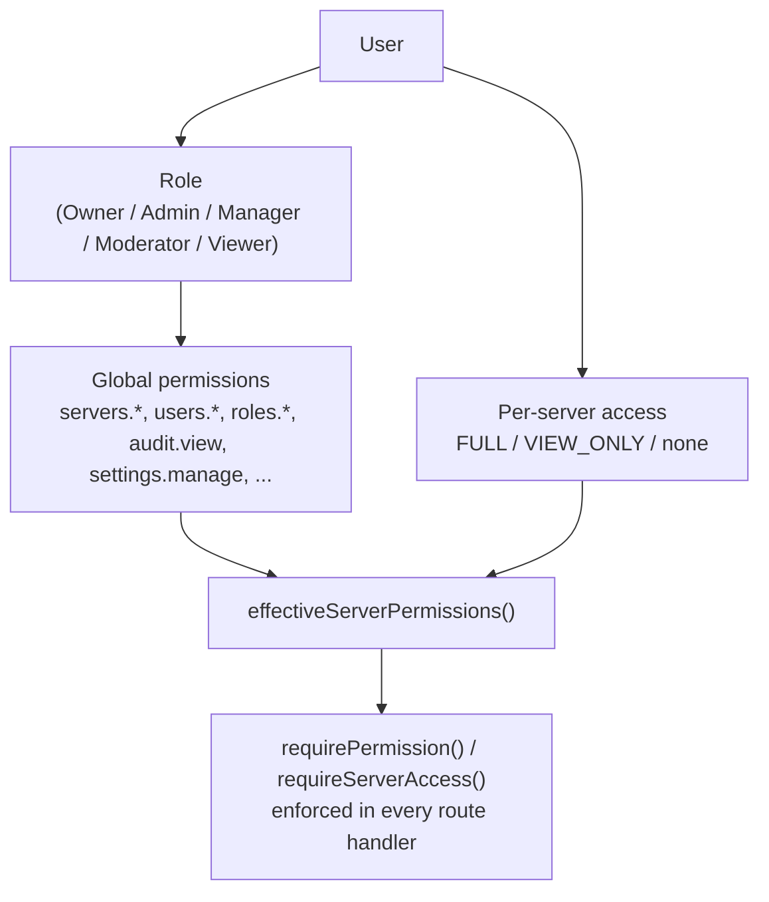

# Architecture

This document explains how minecontroller's pieces fit together: the container layout, how a new Minecraft server gets created, and how access control is enforced. For hands-on setup, see the [main README](../README.md); for the full environment variable reference, see [configuration.md](configuration.md).

## Table of contents

- [Component overview](#component-overview)
- [Directory layout](#directory-layout)
- [Server creation flow](#server-creation-flow)
- [Console: RCON, not stdin](#console-rcon-not-stdin)
- [Access control (RBAC)](#access-control-rbac)
- [Design decisions](#design-decisions)

## Component overview

Everything the panel itself needs — API, frontend, and database — runs in a **single container**. Each managed Minecraft server is a separate **sibling container**, created by the API through the host's Docker socket.



Key points visible in the diagram:

- **No separate database service.** SQLite lives on disk inside the api container's `/data` mount; there's nothing else to run or scale.
- **The API never shells into a Minecraft container.** It talks to the Docker daemon (to create/start/stop containers and stream logs) and to the Minecraft process itself over RCON (to run console commands). Both hops stay inside the host — RCON is never exposed on a published port.
- **`mc_net`** is a dedicated Docker network joined by the api container and every Minecraft container, so RCON is reachable by container DNS name without publishing it to the host at all.

## Directory layout

```
apps/
  api/      Fastify + TypeScript + Prisma (SQLite) — REST API, WebSockets, Docker orchestration
  web/      React + Vite + TypeScript + Tailwind — SPA, built and served by the API in production
packages/
  shared/   Zod schemas, shared TypeScript types, and the RBAC permission logic used by both apps
```

Inside `apps/api/src`:

| Path | Responsibility |
|---|---|
| `modules/<feature>/` | One folder per feature (servers, files, players, roles, users, audit, backups, modrinth, ...), each split into `*.routes.ts` (HTTP handlers + permission checks) and `*.service.ts` (business logic) |
| `plugins/` | Fastify plugins: `prisma.ts` (SQLite connection, WAL mode), `auth.ts` (session + RBAC decorators), `minecraft.ts` (wires the server manager), `liveSessions.ts`, `metricsHistory.ts` |
| `minecraft/` | The Docker/RCON orchestration layer — see below |
| `ws/` | One multiplexed live session per server, backing `/ws/servers/:id` |
| `lib/` | Cross-cutting utilities: safe path resolution, typed errors, 2FA crypto, `server.properties` codec |

## Server creation flow

Creating a server touches the wizard, the API, the Docker daemon, and the new container's own entrypoint script before it's ready to use:



Version/installer lookups per server type (Vanilla, Paper, Fabric, Forge, NeoForge) live in `apps/api/src/minecraft/providers/`, each talking to that ecosystem's own metadata API (Mojang Piston-Meta, PaperMC's `fill.papermc.io`, `meta.fabricmc.net`, etc.). The actual installation work is done by the `itzg/docker-minecraft-server` entrypoint itself — this project does not reimplement a Forge/Fabric/Paper installer.

## Console: RCON, not stdin

Console output is streamed from the Docker log API (`follow: true`); commands are **not** sent via stdin-attach — that path was found to be unreliable against the base image. Instead, the API implements a small Source RCON client (`minecraft/runtime/RconClient.ts`) and talks to each server over `mc_net`.

Each server's RCON password is never stored — it's derived deterministically per server from `SESSION_SECRET` + the server's ID (HMAC-SHA256, `minecraft/runtime/rconSecret.ts`), so there's one less secret at rest.

## Access control (RBAC)

Two layers, both re-checked server-side on **every** request — the frontend's rendering choices are never trusted as the source of truth.



1. **Role-based global permissions** — a fixed permission list (`packages/shared/src/permissions.ts`), assigned per role. Owner implicitly holds every permission and skips the check entirely.
2. **Per-server access level** (`FULL` / `VIEW_ONLY` / no row at all) — narrows just the *server-scoped* subset of a user's role permissions (`servers.*`, `console.*`, `files.*`, `players.*`, `plugins.*`, `backups.*`) down for one specific server. Instance-wide permissions (`users.*`, `roles.*`, `audit.view`, `settings.manage`) are unaffected by server access.

`requireServerAccess` returns `404` (not `403`) when access is denied, so a user without access can't distinguish "this server doesn't exist" from "this server exists but you can't see it." The `/ws/servers/:id` route reuses the same check, plus an explicit `Origin` check — WebSocket upgrades aren't covered by CORS preflight the way `fetch`/XHR are.

## Design decisions

- **SQLite instead of a separate database server.** A deliberate choice for this deployment profile — one admin or a small team, single-tenant, `docker compose up -d` and nothing else to provision. WAL mode plus a 5-second `busy_timeout` (set in `plugins/prisma.ts`) make brief concurrent writes safe. Because the schema is defined through Prisma, moving to PostgreSQL later would mainly be a provider swap and a fresh migration, not an application rewrite — but it isn't needed at this project's target scale.
- **One container per Minecraft server**, orchestrated over the Docker socket with `dockerode`, always using `itzg/docker-minecraft-server`-compatible images. That image already handles Vanilla/Paper/Fabric/Forge/NeoForge installation robustly, so this project doesn't maintain its own installer.
- **RCON over stdin**, as covered above.
- **Network isolation** via a dedicated `mc_net` Docker network so RCON never needs a published host port.
- **Two-layer RBAC**, covered above, enforced identically for REST and WebSocket routes.
