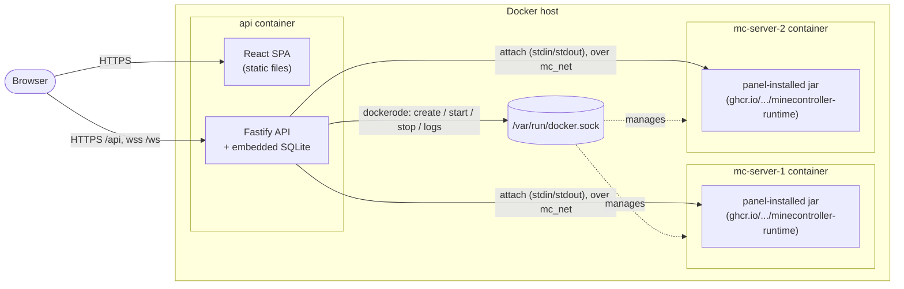
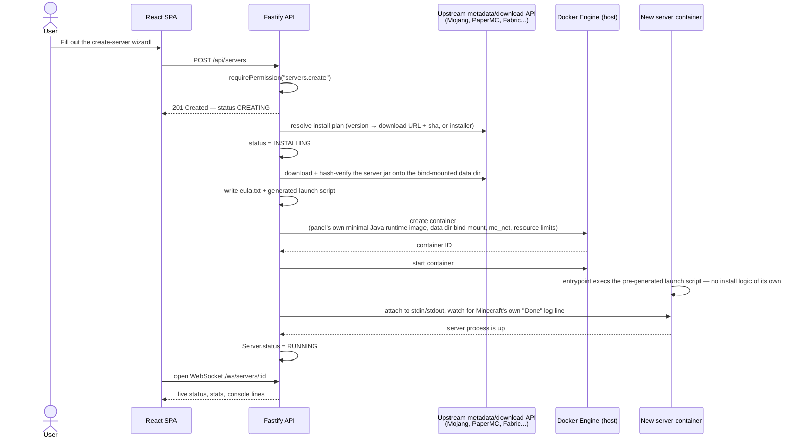
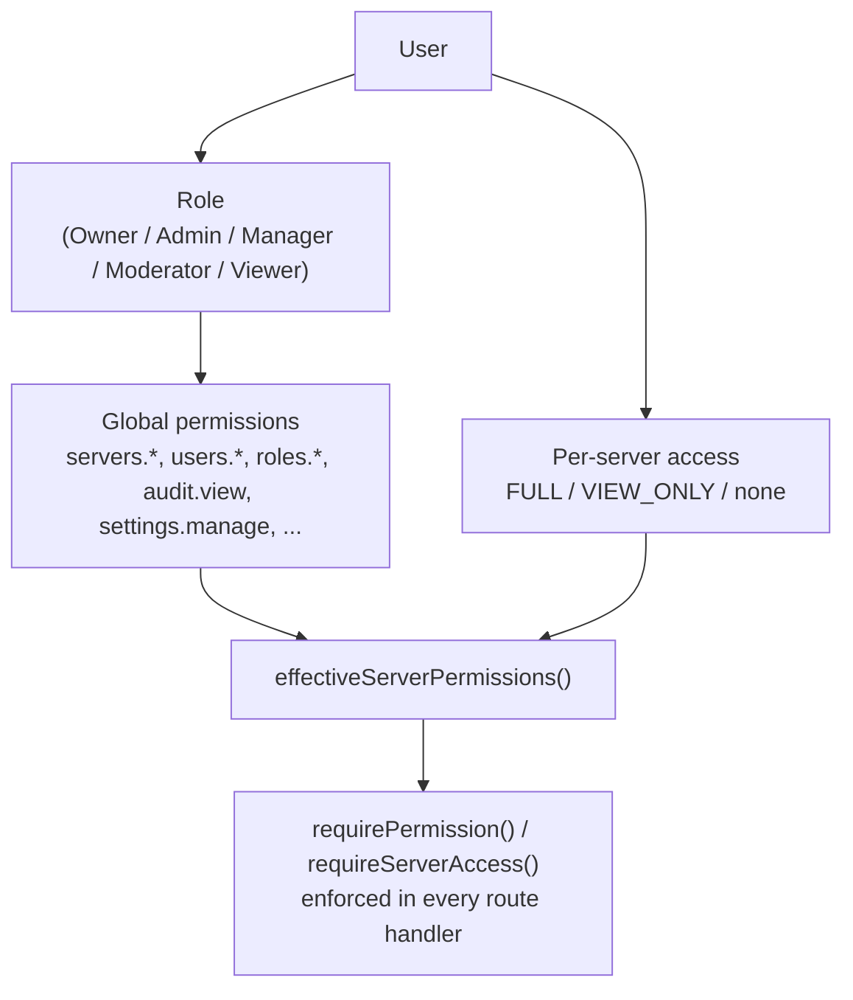

# Architecture

This document explains how minecontroller's pieces fit together: the container layout, how a new Minecraft server gets created, and how access control is enforced. For hands-on setup, see the [main README](../README.md); for the full environment variable reference, see [configuration.md](configuration.md).

## Table of contents

- [Component overview](#component-overview)
- [Directory layout](#directory-layout)
- [Server creation flow](#server-creation-flow)
- [Console: attached stdin, not RCON](#console-attached-stdin-not-rcon)
- [Access control (RBAC)](#access-control-rbac)
- [Notifications](#notifications)
- [Design decisions](#design-decisions)

## Component overview

Everything the panel itself needs — API, frontend, and database — runs in a **single container**. Each managed Minecraft server is a separate **sibling container**, created by the API through the host's Docker socket.



Key points visible in the diagram:

- **No separate database service.** SQLite lives on disk inside the api container's `/data` mount; there's nothing else to run or scale.
- **The API never shells into a Minecraft container.** It talks to the Docker daemon (to create/start/stop containers and stream logs) and to the Minecraft process itself over a raw stdin/stdout attach (to run console commands — see [below](#console-attached-stdin-not-rcon)). Both hops stay inside the host.
- **`mc_net`** is a dedicated Docker network joined by the api container and every Minecraft container — not needed for the console itself anymore (attach goes over the Docker socket, not the network), but still used by the small number of servers left on the legacy RCON path, and kept as the shared network every managed container joins regardless of runtime kind.

## Directory layout

```
apps/
  api/      Fastify + TypeScript + Prisma (SQLite) — REST API, WebSockets, Docker orchestration
  web/      React + Vite + TypeScript + Tailwind — SPA, built and served by the API in production
packages/
  shared/   Zod schemas, shared TypeScript types, and the RBAC permission logic used by both apps
```

Inside `apps/api/src`:

| Path | Responsibility |
|---|---|
| `modules/<feature>/` | One folder per feature (servers, files, players, roles, users, audit, backups, modrinth, ...), each split into `*.routes.ts` (HTTP handlers + permission checks) and `*.service.ts` (business logic) |
| `plugins/` | Fastify plugins: `prisma.ts` (SQLite connection, WAL mode), `auth.ts` (session + RBAC decorators), `minecraft.ts` (wires the server manager), `liveSessions.ts`, `metricsHistory.ts` |
| `minecraft/` | The Docker orchestration layer — install pipeline, container lifecycle, console (attach + legacy RCON) — see below |
| `ws/` | One multiplexed live session per server, backing `/ws/servers/:id` |
| `lib/` | Cross-cutting utilities: safe path resolution, typed errors, 2FA crypto, `server.properties` codec |

## Server creation flow

Creating a server touches the wizard, the API, and the Docker daemon — but unlike an all-in-one image that installs itself at container boot, **the panel installs the server before the long-lived container ever exists**:



Version/installer lookups per server type live in `apps/api/src/minecraft/providers/`, each talking to that ecosystem's own metadata API (Mojang Piston-Meta, PaperMC's `fill.papermc.io`, `meta.fabricmc.net`, etc.) to resolve a concrete download. **Vanilla, Paper, and Fabric** are self-contained server jars, downloaded and hash-verified directly by `ServerInstaller` — this project reimplements that part itself rather than delegating to a third-party image. **Forge and NeoForge** are selectable in the wizard but their install plan isn't implemented yet (they need a real installer *program* run in an ephemeral container, not a direct download) — creating one today fails during `INSTALLING`, not at submission time; see the `TODO(milestone-5)` markers in `ForgeProvider.ts`/`NeoForgeProvider.ts`.

A small number of servers created before this panel-owned install pipeline existed still run the old path (`Server.runtime === "LEGACY"`): a stock [`itzg/docker-minecraft-server`](https://github.com/itzg/docker-minecraft-server) container that installs itself at boot from `VERSION`/`TYPE` env vars, controlled over RCON instead of an attach. New servers never use this path — it's kept only so those pre-existing servers keep working, and is expected to be removed once none are left.

## Console: attached stdin, not RCON

For panel-managed servers (the default for anything created today), the API attaches directly to the container's stdin/stdout (`AttachConsoleSession`, raw TTY, no RCON involved at all) — the container is created with `OpenStdin`/`AttachStdin` and no RCON server ever runs. Commands typed in the Console tab, and every panel-internal poll (online-player list, moderation actions), share this one channel; internal polls are marked `silent` so only user-typed input and the server's own log lines show up in the visible console. Response parsing is prefix-agnostic — Vanilla and Paper log lines are shaped differently (`[HH:MM:SS] [Thread/LEVEL]: ` vs `[HH:MM:SS LEVEL]: `), so replies are sliced from wherever the expected response text actually matched, not a fixed-width prefix strip.

Legacy servers (`Server.runtime === "LEGACY"`, see [above](#server-creation-flow)) still work the old way: console output streamed from the Docker log API, commands sent over a small Source RCON client (`minecraft/runtime/RconClient.ts`) instead — stdin-attach was found unreliable against the third-party base image that path uses. Each such server's RCON password is never stored; it's derived deterministically from `SESSION_SECRET` + the server's ID (HMAC-SHA256, `minecraft/runtime/rconSecret.ts`).

## Access control (RBAC)

Two layers, both re-checked server-side on **every** request — the frontend's rendering choices are never trusted as the source of truth.



1. **Role-based global permissions** — a fixed permission list (`packages/shared/src/permissions.ts`), assigned per role. Owner implicitly holds every permission and skips the check entirely.
2. **Per-server access level** (`FULL` / `VIEW_ONLY` / no row at all) — narrows just the *server-scoped* subset of a user's role permissions (`servers.*`, `console.*`, `files.*`, `players.*`, `plugins.*`, `backups.*`) down for one specific server. Instance-wide permissions (`users.*`, `roles.*`, `audit.view`, `settings.manage`) are unaffected by server access.

`requireServerAccess` returns `404` (not `403`) when access is denied, so a user without access can't distinguish "this server doesn't exist" from "this server exists but you can't see it." The `/ws/servers/:id` route reuses the same check, plus an explicit `Origin` check — WebSocket upgrades aren't covered by CORS preflight the way `fetch`/XHR are.

## Notifications

`NotificationDispatcherService` (`apps/api/src/modules/notifications/`) is the single fan-out point for every notification-worthy event, wired up in `plugins/notifications.ts`. It has two independent delivery mechanisms sharing one fixed category set (`packages/shared/src/notifications.ts`: server status, player activity, crash, backup, performance, update available):

- **Web push** — per user, per server (`NotificationPreference` + `PushSubscription`), standard VAPID Web Push (see [configuration.md](configuration.md#web-push-notifications)). Any access level (FULL or VIEW_ONLY) may set their own push preferences for a server.
- **External service channels** — per server, not per user (`NotificationChannel`: Discord/Telegram/Slack/generic webhook), for cases like a community Discord where everyone should see the message regardless of who's logged into the panel. Secrets (webhook URLs, bot tokens) are encrypted at rest (`lib/webhookCrypto.ts`, same AES-256-GCM-from-`SESSION_SECRET` pattern as TOTP secrets) and gated on `servers.settings.edit` (FULL access only) — a VIEW_ONLY user sees configured targets read-only, without the secret.

Event sources call `dispatcher.dispatch({serverId, category, title, body})` rather than the dispatcher polling anything itself, except for two small self-contained pollers:

- `MinecraftServerManager`'s existing `"status"` event → server status / crash.
- `PlayerActivityTracker`'s `"playerJoin"`/`"playerLeave"` events (added alongside its existing DB writes) → player activity.
- The backups route dispatches directly around its own `BackupService.create()` call.
- `performanceChecker.ts` polls the existing `MetricsHistoryStore` for high memory usage (no TPS tracking exists in this codebase, so this category is memory-only).
- `updateChecker.ts` periodically re-resolves each server's install plan through its existing provider (the same lookup the create-server wizard already uses) to detect a newer available version.

## Design decisions

- **SQLite instead of a separate database server.** A deliberate choice for this deployment profile — one admin or a small team, single-tenant, `docker compose up -d` and nothing else to provision. WAL mode plus a 5-second `busy_timeout` (set in `plugins/prisma.ts`) make brief concurrent writes safe. Because the schema is defined through Prisma, moving to PostgreSQL later would mainly be a provider swap and a fresh migration, not an application rewrite — but it isn't needed at this project's target scale.
- **One container per Minecraft server**, orchestrated over the Docker socket with `dockerode`. Each runs the panel's own minimal Java-only image (`runtime-images/`, published to GHCR) rather than a third-party all-in-one image — the panel resolves, downloads, and verifies the actual server software itself (`ServerInstaller`), so the container only ever execs an already-installed jar.
- **Attached stdin over RCON**, as covered above — no RCON server, no RCON password, no extra port for panel-managed servers at all. RCON is kept only for the legacy path's pre-existing servers.
- **Network isolation** via a dedicated `mc_net` Docker network so the legacy path's RCON never needs a published host port.
- **Two-layer RBAC**, covered above, enforced identically for REST and WebSocket routes.
- **Extra ports as their own table (`ServerAllocation`), not an array column on `Server`.** Each server keeps its single fixed `port` (the primary/game port, baked into the container's `PortBindings` since creation) unchanged; additional ports a server publishes — for a web map, voice chat, Geyser, etc. — live in a separate table with a global `UNIQUE` constraint, checked at the API layer against both this table and `Server.port` before insert (no single DB constraint can span two different columns/tables). Kept deliberately simple over a full Pterodactyl-style allocation *pool*: no separate "reserve a port" step, no per-allocation protocol/label metadata — just a port number, published host==container on both TCP and UDP, applied on the server's next (re)start like any other container-level setting. See [operations.md#port-allocations](operations.md#port-allocations) for the user-facing behavior.
