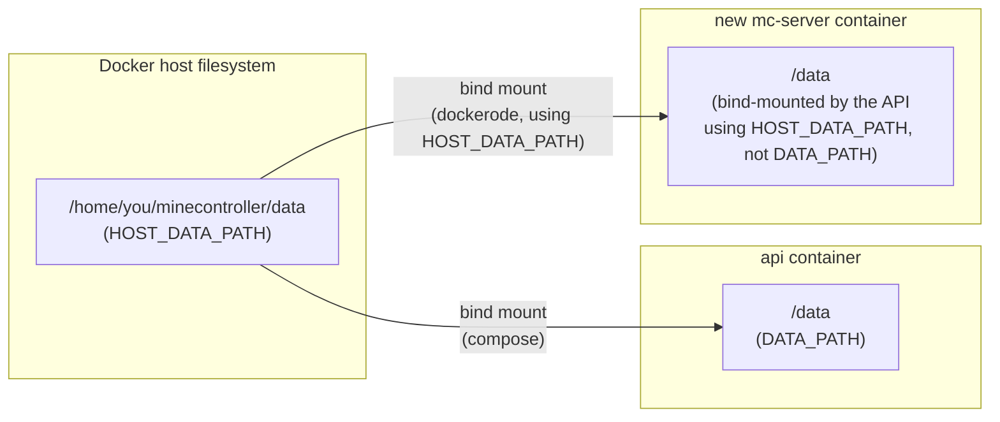

# Configuration reference

All variables are documented inline in [`.env.example`](../.env.example) — copy it to `.env` and adjust. This page covers the ones worth understanding before you change them.

## Core variables

| Variable | Meaning |
|---|---|
| `SESSION_SECRET` | Long random value used to sign sessions, CSRF tokens, and legacy-path servers' derived RCON password (see [architecture.md](architecture.md#console-attached-stdin-not-rcon)). Generate with `openssl rand -hex 32`. **Treat this like a root password** — anyone who has it can forge any session. |
| `WEB_ORIGIN` | The panel's publicly reachable URL (used for cookie and CORS settings). Set this to the real `https://` domain in production. |
| `COOKIE_SECURE` | Leave `true` once a reverse proxy terminates TLS in front of the panel. Only set `false` for plain local `http://` use without TLS. |
| `HOST_DATA_PATH` | Normally left unset — auto-detected. See [below](#host_data_path-the-sibling-container-problem). |
| `MC_PORT_RANGE_MIN` / `MC_PORT_RANGE_MAX` | Port range the panel picks a free port from when creating new servers. |
| `MINECRAFT_IMAGE` | Docker image used for itzg-managed Minecraft server containers. Must stay compatible with `itzg/docker-minecraft-server`'s `VERSION`/`TYPE`/`EULA` env-var contract and RCON support. |
| `RUNTIME_IMAGE_BASE` | Registry/repo prefix for the panel-managed Java runtime images (`:java8`/`:java17`/`:java21`/`:java25`), pulled automatically on first use. Only change this for a fork or a local test build. |
| `VAPID_PUBLIC_KEY` / `VAPID_PRIVATE_KEY` / `VAPID_SUBJECT` | Optional. Only needed to pin a specific VAPID keypair (see [below](#web-push-notifications)) — web push works out of the box without setting any of these. |

## Web push notifications

Push notifications (per-user, per-server toggles under a server's **Settings → Notifications** tab) use the standard [VAPID](https://datatracker.ietf.org/doc/html/rfc8292)-based Web Push protocol — no Apple Developer account or certificate needed, since iOS 16.4+ implements the same web standard as every other browser.

**Zero configuration needed**: on first boot, if `VAPID_PUBLIC_KEY`/`VAPID_PRIVATE_KEY` aren't set, the panel generates its own keypair and persists it in the database (the same instance-wide settings table Modrinth's UA override uses) — every later boot reuses that same stored pair instead of generating a new one, since a fresh keypair would silently invalidate every browser's existing push subscription (a subscription is cryptographically bound to the exact public key it was created with). Users can enable push per server from that server's Notifications tab as soon as the panel is running — the browser only prompts for notification permission when they explicitly click to enable it, never on page load.

Set `VAPID_PUBLIC_KEY`/`VAPID_PRIVATE_KEY`/`VAPID_SUBJECT` yourself only if you want to **pin** a specific keypair — e.g. migrating to a fresh database without invalidating existing subscriptions, or sharing one keypair across multiple instances. Generate one with `npx web-push generate-vapid-keys`. `VAPID_SUBJECT` (a `mailto:` address or `https://` URL identifying you, per the VAPID spec) defaults to `mailto:admin@<your WEB_ORIGIN's hostname>` if left unset.

## `HOST_DATA_PATH`: the sibling-container problem

The api container mounts `./data` at `/data` and works internally with that path (`DATA_PATH=/data`). But when the API creates a *new* Minecraft server container, it does so by talking directly to the **host's** Docker daemon over the Docker socket — and the daemon has no idea what `/data` means from inside the api container. It needs the path exactly as it exists **on the host** to set up the matching bind mount for the new sibling container.



Both containers end up mounting the same host directory, so the API needs that host-side path — but it doesn't need to be told it by hand. On startup it asks the Docker daemon to inspect **its own container** (Docker sets a container's hostname to its own ID by default, and `docker-compose.yml` doesn't override that) and reads the host-side source of its own `/data` mount straight out of the answer. No absolute path to type in, and nothing to get wrong.

This only fails to auto-detect in non-standard setups — rootless Docker, Podman, a container hostname overridden elsewhere, or the api container not actually being the one Docker thinks it is. If a newly created server gets stuck in `INSTALLING`, or the panel logs "Could not auto-detect the host path for the data volume" at startup, set `HOST_DATA_PATH` explicitly:

```
# Linux/macOS:
HOST_DATA_PATH=/home/youruser/minecontroller/data
# Windows + Docker Desktop:
HOST_DATA_PATH=//c/Users/you/minecontroller/data
```

Either way, you can confirm it worked by inspecting a newly created server's container with `docker inspect <container>` and checking its `Binds` entry points at a host path that actually exists.
