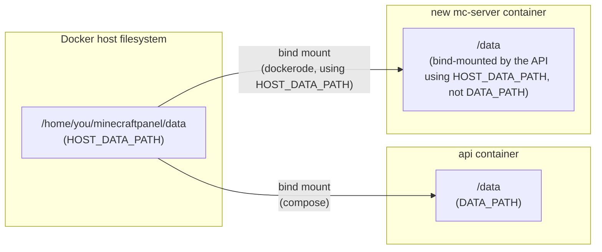

# Configuration reference

All variables are documented inline in [`.env.example`](../.env.example) — copy it to `.env` and adjust. This page covers the ones worth understanding before you change them.

## Core variables

| Variable | Meaning |
|---|---|
| `SESSION_SECRET` | Long random value used to sign sessions, CSRF tokens, and every server's derived RCON password. Generate with `openssl rand -hex 32`. **Treat this like a root password** — anyone who has it can forge any session. |
| `WEB_ORIGIN` | The panel's publicly reachable URL (used for cookie and CORS settings). Set this to the real `https://` domain in production. |
| `COOKIE_SECURE` | Leave `true` once a reverse proxy terminates TLS in front of the panel. Only set `false` for plain local `http://` use without TLS. |
| `HOST_DATA_PATH` | **Absolute path, as seen by the Docker host**, to this project's `./data` folder. See [below](#host_data_path-the-sibling-container-problem) — getting this wrong means newly created Minecraft containers see no data, or the wrong data. |
| `MC_PORT_RANGE_MIN` / `MC_PORT_RANGE_MAX` | Port range the panel picks a free port from when creating new servers. |
| `MINECRAFT_IMAGE` | Docker image used for Minecraft server containers. Must stay compatible with `itzg/docker-minecraft-server`'s `VERSION`/`TYPE`/`EULA` env-var contract and RCON support. |

## `HOST_DATA_PATH`: the sibling-container problem

The api container mounts `./data` at `/data` and works internally with that path (`DATA_PATH=/data`). But when the API creates a *new* Minecraft server container, it does so by talking directly to the **host's** Docker daemon over the Docker socket — and the daemon has no idea what `/data` means from inside the api container. It needs the path exactly as it exists **on the host** to set up the matching bind mount for the new sibling container.



Both containers end up mounting the same host directory, but the API has to be told that host-side path explicitly — it cannot derive it from its own `/data` view. Set it to the absolute path to `./data` as your OS sees it:

```
# Linux/macOS:
HOST_DATA_PATH=/home/youruser/minecraftpanel/data
# Windows + Docker Desktop:
HOST_DATA_PATH=//c/Users/you/minecraftpanel/data
```

If a newly created server gets stuck in `INSTALLING` or its container starts with no data, this is the first thing to check — inspect the new container with `docker inspect <container>` and confirm its `Binds` entry points at a host path that actually exists.
